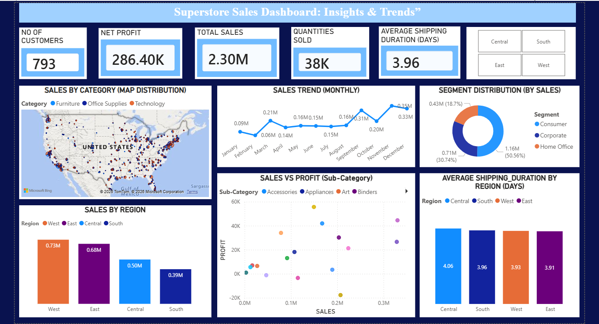

**Superstore Sales Dashboard: Insights & Trends**

📌**Overview**
This project presents an interactive Sales Dashboard built to analyze and visualize key business metrics from a Superstore dataset. It helps in understanding sales performance, profit trends, customer distribution, and shipping efficiency across different regions and categories.

**Dashboard Overview**

🎯 **Objectives**
1. Analyze overall sales and profit performance  
2. Identify top-performing regions and segments  
3. Track monthly sales trends  
4. Evaluate shipping efficiency  
5. Provide actionable business insights through visualization  

📊 **Key Performance Indicators (KPIs)**
1.Total Customers: 793
2.Total Sales: 2.30M
3.Net Profit: 286.40K
4.Quantities Sold: 38K
5.Average Shipping Duration: 3.96 Days

📈**Dashboard Features**
1. Sales by Category (Map Distribution)
Displays geographical distribution of sales across the United States
Categories include: Furniture, Office Supplies, Technology

2.Monthly Sales Trend
Line chart showing sales variation across months
Helps identify seasonality and peak sales periods

3. Segment Distribution (Donut Chart)
Sales contribution by segments:
Consumer
Corporate
Home Office

4. Sales by Region (Bar Chart)
Compares sales across regions: West, East, Central, South
Highlights top-performing regions

5. Sales vs Profit (Scatter Plot)
Shows relationship between sales and profit by sub-category
Identifies high-profit and loss-making areas

6. Average Shipping Duration by Region
Compares delivery efficiency across regions
Helps in logistics performance analysis

🎛️ **Filters / Slicers**
Region filter (Central, South, East, West)
Enables dynamic interaction with dashboard visuals\

🛠️ **Tools & Technologies**
Power BI – Data visualization
Excel / CSV Dataset – Data source
DAX – Calculations and KPIs

📌**Insights**
1. West region generates the highest sales  
2. Consumer segment contributes the most revenue  
3. Some sub-categories show high sales but low profit  
4. Shipping duration is relatively consistent across regions
   
🚀 **Future Improvements**
Add profit margin analysis
Include customer segmentation insights
Introduce forecasting for sales trends
Enhance interactivity with more filters
