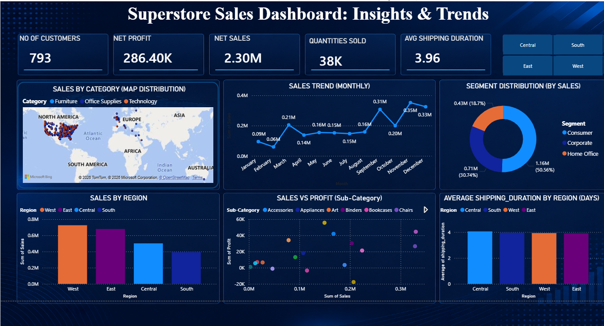

**Superstore Sales Dashboard: Insights & Trends**

📌**Overview**
An interactive Sales Dashboard built to analyze and visualize key business metrics from a Superstore dataset — covering sales performance, profit trends, customer distribution, and shipping efficiency across regions and categories.

**Dashboard Overview**

🎯 **Objectives**
Analyze overall sales and profit performance
Identify top-performing regions and segments
Track monthly sales trends
Evaluate shipping efficiency
Provide actionable business insights through visualization

📊 **Key Performance Indicators (KPIs)**
1.Total Customers: 793
2.Total Sales: 2.30M
3.Net Profit: 286.40K
4.Quantities Sold: 38K
5.Average Shipping Duration: 3.96 Days

📈**Dashboard Features**
1. Sales by Category (Map Distribution)
Displays geographical distribution of sales across the United States
Categories include: Furniture, Office Supplies, Technology

2.Monthly Sales Trend
Line chart showing sales variation across months
Helps identify seasonality and peak sales periods

3. Segment Distribution (Donut Chart)
Sales contribution by segments:
Consumer
Corporate
Home Office

4. Sales by Region (Bar Chart)
Compares sales across regions: West, East, Central, South
Highlights top-performing regions

5. Sales vs Profit (Scatter Plot)
Shows relationship between sales and profit by sub-category
Identifies high-profit and loss-making areas

6. Average Shipping Duration by Region
Compares delivery efficiency across regions
Helps in logistics performance analysis

🎛️ **Filters / Slicers**
Region filter (Central, South, East, West)
Enables dynamic interaction with dashboard visuals\

🛠️ **Tools & Technologies**
Power BI – Data visualization
Excel / CSV Dataset – Data source
DAX – Calculations and KPIs

📌**Insights**
**West region** leads in sales, contributing the highest revenue among all regions, making it the most commercially active zone.
**Consumer segment** dominates with the largest share of sales, suggesting B2C transactions outperform Corporate and Home Office segments.
**High sales ≠ High profit** — Certain sub-categories (e.g., Tables, Bookcases in Furniture) show significant sales volume but negative or low profit margins, indicating pricing or cost issues.
**Technology drives profitability** — Despite moderate sales volume, Technology sub-categories tend to yield higher profit margins compared to Furniture.
**Shipping is efficient and consistent** — An average of 3.96 days across all regions suggests a stable supply chain with no major regional delivery bottlenecks.
**Seasonality is visible** — Monthly sales trends reveal peak periods likely around Q4 (holiday season), which can guide inventory and marketing planning.
**Net profit margin is ~12.4% (286.40K / 2.30M)** — This is moderate for retail, highlighting room for cost optimization especially in low-margin categories.
   
🚀 **Future Improvements**
Add profit margin analysis
Include customer segmentation insights
Introduce forecasting for sales trends
Enhance interactivity with more filters
